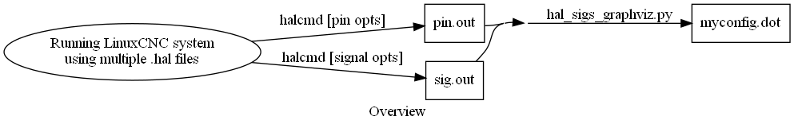
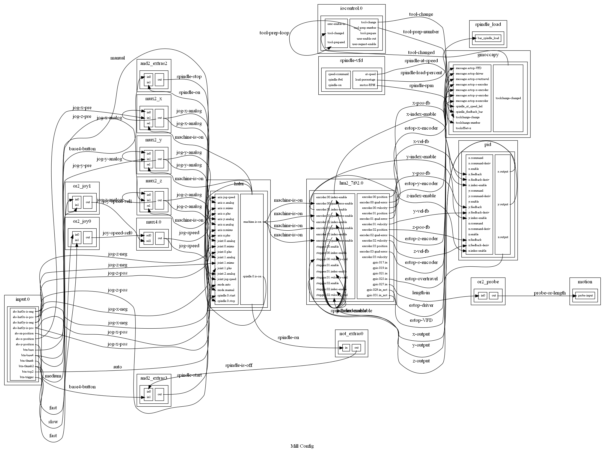

# LCNC_HAL_to_graphviz
Translates LCNC HAL(Hardware Abstraction Layer) to Graphviz DOT language.


## Long Story:

For years I have been documenting my LinuxCNC configurations using doxygen and the Graphviz dot language.
I find this very helpful for understanding configurations but difficult to maintain. (documentation should always be close or ideally generated by code)
Early on I dreamed of generating dot direct from raw HAL files or halcmd output. 
I started parsers several times but never finished.
From debugging and documenting multiple CNC configs, I found dividing the HAL into multiple files and diagramming each file was helpful.
I used halcmd and grep to find unused signals that could be removed from the HAL to simplify the config.

Back in 2021, I updated the joypad wiki with my multiple HAL file approach and manually created graphs. 
https://forum.linuxcnc.org/38-general-linuxcnc-questions/41298-simple-remote-pendant-with-2-8-1-analog-joystick-values?start=10
When a joypad question came up in 2025 https://forum.linuxcnc.org/38-general-linuxcnc-questions/56272-problem-analog-jog-via-gamepad-does-not-move-axis-in-linuxcnc the uploaded HAL and diagrams were no longer linked.
I looked for the original files and couldn't find them. 
Faced with the recreating the dot diagrams (and being retired), I decided to take the time and automate this process.

I was vaguely aware of Rockhopper and some other approaches.
https://forum.linuxcnc.org/38-general-linuxcnc-questions/49057-hal-graphing

I tried the python code from 
https://forum.linuxcnc.org/24-hal-components/14592-visualizing-hal-nets-with-graphviz#325091

but noticed these approaches don't take advantage of dot features. 
Mainly, components can be represented better with subgraphs, records and html-like.
HAL signals can be mapped to dot edges NOT nodes.

Realize that once you can automatically generate graphs from HAL, the problem becomes one of complexity.
Complexity can be reduced by:
    # Only loading portions of the config (using multiple .hal files)
    # Better dot node representations of the HAL components. (records, html-like, subclusters)
    # Using dot edge arrow heads to map HAL pin directions.
    # Use halcmd to identify unused signals that can be removed from config without any loss of functionality.


## Short Story:

Goal is to divide config HAL into multiple files (to reduce graph complexity) and automatically generate graphviz dot from the files to achieve maintainablity.

## Goals:
- [x] Use halcmd to selectively load portions of the config to reduce graph complexity.
- [x] Use dot edges to represent HAL signals.
- [ ] Use dot arrow heads to correctly represent HAL pin directions. (IN, OUT, I/O)
- [ ] Use dot invisible nodes to represent signals that don't have both a source and destination in the loaded HAL system.
- [ ] Have some method to selectively include or exclude HAL components or features. (reduce complexity)
- [ ] Have an option to include jpg representation for the component.

# Overview of Process:


## Prerequisites:
- Get this repository.
- Install graphviz with "sudo apt-get install graphviz"
## Usage:
- Start LCNC system.
- Run the halcmd twice to create pin.out and sig.out
```
halcmd -s show pin | grep -e "==" > pin.out
halcmd -s show pin | grep -e "==" -e "<=>" > pin.out (also includes I/O signals)
halcmd -s show sig | grep -v "^$" > sig.out
```
- Run the python code to create the dot output.
```
python3 main.py > myconfig.dot
```
## Example Output: 
(showning complexity and other problems.)

